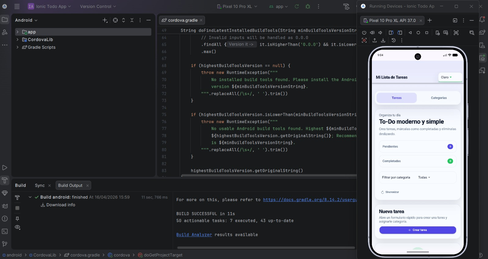
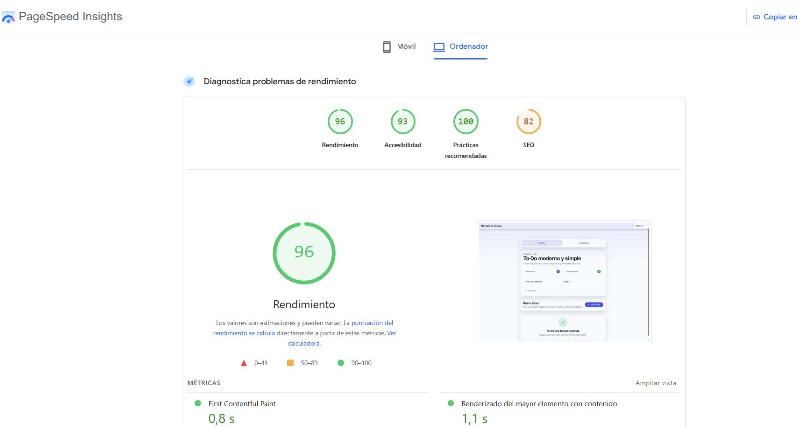

# Ionic To-Do App

## 📌 Descripción
Aplicación híbrida hecha con Ionic + Angular para gestionar tareas y categorías. Incluye creación y seguimiento de tareas, organización por categorías y un feature flag con Firebase Remote Config.

## 🛠️ Stack del proyecto
- **Framework**: Ionic 8 + Angular 20
- **Arquitectura UI**: componentes standalone
- **Persistencia local**: Ionic Storage
- **Configuración remota**: Firebase Remote Config
- **Compilación híbrida**: Cordova Android / iOS
- **Control de versiones**: Git + GitHub

## ✅ Funcionalidades implementadas
- **CRUD de tareas**: crear, completar y eliminar
- **CRUD de categorías**: crear, editar y eliminar
- **Asignación de categorías** a tareas
- **Filtro de tareas por categoría**
- **Feature flag con Firebase Remote Config** para mostrar u ocultar la sección de estadísticas
- **Cambio de tema**: system, light, dark
- **Optimización de rendimiento** con lazy loading, `OnPush`, `trackBy` y virtualización de listas

## 📁 Estructura general
- **`src/app/pages/home`**: pantalla principal de tareas
- **`src/app/pages/categories`**: pantalla de categorías
- **`src/app/services/task.service.ts`**: lógica de tareas
- **`src/app/services/category.service.ts`**: lógica de categorías
- **`src/app/services/firebase.service.ts`**: integración con Remote Config
- **`src/app/services/theme.service.ts`**: gestión de tema
- **`src/app/models`**: interfaces `Task` y `Category`
- **`config.xml`**: configuración Cordova

## ⚙️ Requisitos previos
- **Node.js** 20+
- **npm** 10+
- **Ionic CLI**
- **Cordova CLI**
- **Android Studio** con Android SDK instalado
- **JDK 21**
- **Gradle** instalado y configurado en Windows
- **Xcode** para compilar iOS en macOS
- **Cuenta Firebase** con Remote Config habilitado

## 📦 Instalación
```bash
npm install
```

## 🌐 Ejecución en navegador
```bash
ionic serve
```

## 🚀 Build web de producción
```bash
npm run build
```

La salida queda en:

```text
www
```

## 📱 Compilación y ejecución con Cordova

### Android
Si la plataforma Android no existe:

```bash
npx cordova platform add android
```

Para compilar el APK:

```bash
npx cordova build android
```

APK generado:

```text
platforms/android/app/build/outputs/apk/debug/app-debug.apk
```

Ejecutar en emulador o dispositivo Android conectado:

```bash
npx cordova run android
```

Proyecto Android:

```text
platforms/android
```

Instalar con ADB:

```bash
adb install -r platforms/android/app/build/outputs/apk/debug/app-debug.apk
```

### iOS
Si la plataforma iOS no existe:

```bash
npx cordova platform add ios
```

Para compilar:

```bash
npx cordova build ios
```

Ejecutar en simulador iOS desde macOS:

```bash
npx cordova emulate ios
```

Proyecto iOS:

```text
platforms/ios
```

## 🔧 Configuración de Cordova
Datos principales de `config.xml`:

- **App ID**: `com.yesid.ionictodoapp`
- **App name**: `Ionic Todo App`
- **Version**: `0.0.1`

## 🔥 Configuración de Firebase
Firebase se inicializa en `src/main.ts`.

### Pasos generales
1. Crear un proyecto en Firebase.
2. Habilitar **Remote Config**.
3. Registrar la app web en Firebase.
4. Copiar la configuración del proyecto Firebase y colocarla en `src/main.ts`.
5. Agregar los archivos de plataforma si aplica:
   - **Android**: `google-services.json`
   - **iOS**: `GoogleService-Info.plist`

## 🎛️ Cómo cambiar el feature flag desde Firebase Console
El feature flag controla la visibilidad de la sección de estadísticas.

### Parámetro esperado
- **Key**: `show_statistics`
- **Type**: boolean
- **Default recomendado**: `true`

### Pasos en consola
1. Ir a **Firebase Console**.
2. Abrir el proyecto correspondiente.
3. Entrar a **Remote Config**.
4. Crear o editar el parámetro:
   - `show_statistics`
5. Asignar valor:
   - `true` para mostrar estadísticas
   - `false` para ocultarlas
6. Publicar cambios.
7. Volver a abrir la aplicación o esperar a que la configuración se actualice.

## ⚡ Optimización de rendimiento
- **Lazy loading** de páginas con `loadComponent`
- **`ChangeDetectionStrategy.OnPush`** en componentes principales
- **`trackBy`** en iteraciones para reducir renders innecesarios
- **Virtualización de listas** para tareas y categorías con Angular CDK
- **Uso de `async` pipe** para evitar suscripciones manuales abiertas
- **Diferimiento de inicialización de Remote Config** para reducir impacto en la carga inicial
- **Remoción de precarga global de rutas** para bajar trabajo crítico inicial

## 🧩 Calidad y mantenibilidad
Se intentó mantener el proyecto ordenado y fácil de entender, para que cada parte tuviera una responsabilidad clara y los cambios fueran más sencillos de hacer durante el desarrollo.

## 📝 Respuestas a las 3 preguntas de la prueba

### 1. Principales desafíos enfrentados
- Configurar el entorno de Cordova para compilar correctamente.
- Resolver detalles de build en Android.
- Ajustar el feature flag con Firebase Remote Config sin afectar la experiencia de uso.

### 2. Técnicas de optimización aplicadas y por qué
- **Lazy loading** para cargar solo las pantallas cuando se necesitan.
- **OnPush** para reducir ciclos de detección de cambios innecesarios.
- **Virtual scroll** para soportar listas grandes de tareas y categorías de manera más eficiente.
- **`trackBy`** en loops para evitar recreación innecesaria del DOM.
- **`async` pipe** para trabajar con observables sin dejar suscripciones abiertas.
- **Diferimiento de Remote Config** para disminuir el impacto en el render inicial y mejorar métricas de carga.

### 3. Cómo se aseguró la calidad y mantenibilidad del código
Se trabajó de forma ordenada, buscando que el código fuera claro, entendible y fácil de mantener a medida que se iban agregando mejoras y ajustes.

## 📎 Entregables
- **Repositorio público**: agregar URL del repositorio aquí
- **APK generado**: `platforms/android/app/build/outputs/apk/debug/app-debug.apk`
- **Enlace de descarga del APK**: agregar URL pública aquí si se publica en Release, Drive o similar
- **IPA**: agregar ruta o enlace aquí
- **Video demo app**: https://drive.google.com/file/d/1ZS41PjuWCK6U6cAXO58bMNkZSYl8L4y_/view?usp=sharing
- **Video demo Firebase Remote Config**: https://drive.google.com/file/d/1QhXQX7W4K-0l36QKlMZSnnDT_9LN1tKd/view?usp=sharing
- **Capturas**:
  - **Aplicación funcionando en emulador Android**

    

  - **Resultado de rendimiento en PageSpeed**

    

  - **QR de descarga para Android**

    
- **QR Android**:

  

- **QR iOS**:

  
- **README completo**: incluido en este archivo

## 💻 Comandos útiles
### Instalar dependencias
```bash
npm install
```

### Ejecutar en navegador
```bash
ionic serve
```

### Build web
```bash
npm run build
```

### Build Android
```bash
npx cordova build android
```

### Run Android
```bash
npx cordova run android
```

### Build iOS
```bash
npx cordova build ios
```

## 📍 Estado final de la prueba
- **CRUD de tareas**: completado
- **CRUD de categorías**: completado
- **Asignación y filtrado por categoría**: completado
- **Feature flag con Firebase Remote Config**: completado
- **Compilación Android con Cordova**: completada
- **APK generado**: completado
- **IPA**: pendiente de agregar
